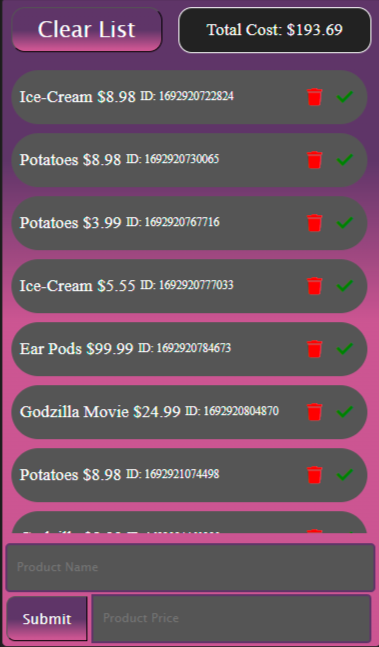

# todo-app-jQuery

## Front-End jQuery Application

## Description

A todo app build with HTML, CSS, and jQuery.

## Table of Contents

-   [todo-app-jQuery](#todo-app-jquery)
    -   [Front-End jQuery Application](#front-end-jquery-application)
    -   [Description](#description)
    -   [Table of Contents](#table-of-contents)
    -   [Purpose](#purpose)
    -   [Usage](#usage)
    -   [Technologies](#technologies)
    -   [License](#license)
    -   [About](#about)
    -   [Badges](#badges)

## Purpose

Brushing up on my jQuery.

## Usage

This [Shopping List](https://d-whipp.github.io/todo-app-jQuery/) application is simple to use. Click the link and you'll be taken to the deployed app (using Github Pages). There you can add items to a list, checkmark them, delete a single item, and clear the list. These items are saved to localStorage.

## Technologies

-   HTML5
-   CSS3
-   Javascript
-   jQuery
-   localStorage

## License

This is free and unencumbered software released into the public domain.

Anyone is free to copy, modify, publish, use, compile, sell, or
distribute this software, either in source code form or as a compiled
binary, for any purpose, commercial or non-commercial, and by any
means.

In jurisdictions that recognize copyright laws, the author or authors
of this software dedicate any and all copyright interest in the
software to the public domain. We make this dedication for the benefit
of the public at large and to the detriment of our heirs and
successors. We intend this dedication to be an overt act of
relinquishment in perpetuity of all present and future rights to this
software under copyright law.

THE SOFTWARE IS PROVIDED "AS IS", WITHOUT WARRANTY OF ANY KIND,
EXPRESS OR IMPLIED, INCLUDING BUT NOT LIMITED TO THE WARRANTIES OF
MERCHANTABILITY, FITNESS FOR A PARTICULAR PURPOSE AND NONINFRINGEMENT.
IN NO EVENT SHALL THE AUTHORS BE LIABLE FOR ANY CLAIM, DAMAGES OR
OTHER LIABILITY, WHETHER IN AN ACTION OF CONTRACT, TORT OR OTHERWISE,
ARISING FROM, OUT OF OR IN CONNECTION WITH THE SOFTWARE OR THE USE OR
OTHER DEALINGS IN THE SOFTWARE.

For more information, please refer to <https://unlicense.org>

## About

Hello, my name is David  
You can email me at dwhipp88@gmail.com  
You can view my [github](https://github.com/D-Whipp).  
Check out my [portfolio](https://splendid-ganache-f82581.netlify.app/).  
Let's make a connection! [LinkedIn](https://www.linkedin.com/in/david-w-079841213/)

## Badges

